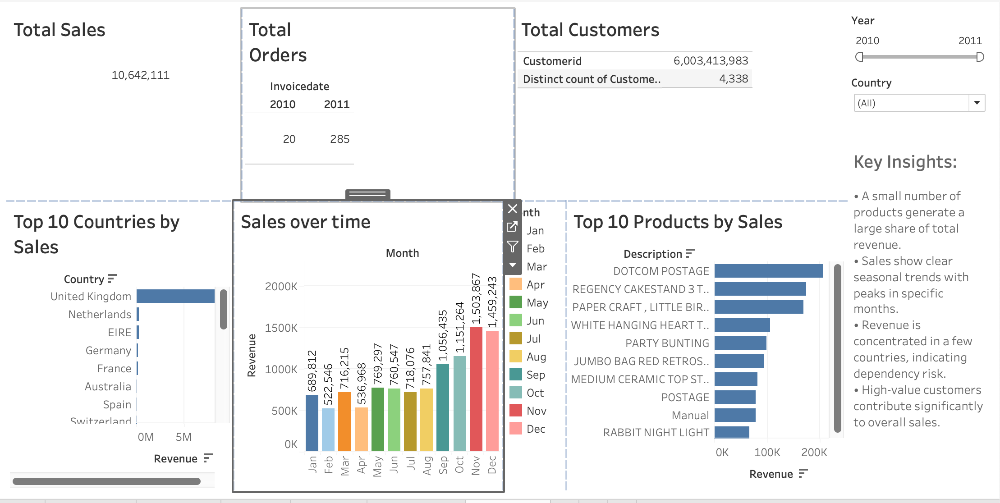

# 📊 E-Commerce Sales Visualization & Analysis

## 🔍 Project Overview
This project focuses on analyzing e-commerce sales data to uncover **actionable business insights** and build **interactive visualizations** that support data-driven decision-making.

The analysis explores sales performance, customer behavior, and product trends to answer key business questions such as:

- What drives revenue growth?
- Which products and categories perform best?
- How do sales vary across time and segments?

This project demonstrates an end-to-end data analytics workflow including:  
**data cleaning → transformation → analysis → visualization → insights**

---

## 🎯 Business Objectives
- Analyze overall sales performance and key KPIs  
- Identify top-performing products and categories  
- Understand customer purchase behavior  
- Track trends across time (daily/monthly patterns)  
- Provide insights to improve revenue and decision-making  

---

## 🛠️ Tools & Technologies
- **SQL** – Data querying and transformation  
- **Excel / CSV** – Data preprocessing  
- **Power BI / Tableau / Visualization Tool** – Dashboard creation *(update based on your tool)*  
- **Python (optional)** – Data analysis *(if used)*  

---

## 📁 Repository Structure
```
ecommerce_sales_visualization/
│
├── data/                      # Raw / cleaned datasets
├── sql_code/                  # Analysis (using SQL)
├── dashboard/                 # Dashboard screenshot
├── visualization/             # Visualization file
└── README.md                  # Project documentation
```

---

## 📊 Key Analysis Performed

### 1. Sales Performance Analysis
- Total revenue and order volume tracking  
- Sales trends over time  
- Peak sales periods identification  

### 2. Product-Level Insights
- Top-selling products  
- Category-wise performance  
- Contribution to overall revenue  

### 3. Customer Insights
- Purchase patterns  
- High-value customers (if applicable)  
- Behavioral trends  

### 4. Data Visualization
- Interactive dashboards for exploration  
- KPI metrics (Revenue, Orders, Profit)  
- Filters and drill-down capabilities  

---

## 📈 Dashboard Features
- Interactive filters (category, time, region)  
- KPI cards for quick business overview  
- Trend analysis using line/bar charts  
- Product and category breakdown visuals  

---

## 💡 Key Insights (Customize Based on Your Project)
- A small set of top products contributes significantly to revenue  
- Sales show seasonal or periodic spikes  
- Certain categories outperform consistently  
- Customer purchase behavior indicates repeat buying patterns  

---

## 🚀 Business Impact
- Helps stakeholders identify **high-performing products**  
- Enables **data-driven pricing and marketing strategies**  
- Supports **inventory and demand planning**  
- Improves overall **decision-making efficiency**  

---

## 📌 How to Use
1. Download the dataset
2. Open dashboard file (Power BI / Tableau)  
3. Interact with filters to explore insights  

---

## 📷 Dashboard Preview



---

## 👨‍💻Author - Vijaya Kumar Kanipakam

This project is part of my portfolio, showcasing the Data Visualization skills essential for Data Analyst/Business Analyst roles. If you have any questions, feedback, or would like to collaborate, feel free to get in touch!

### Stay Updated and Join the Community

For more content on Analytics, data analysis, and other data-related topics, make sure to follow me on social media and join our community:

- **LinkedIn**: [Connect with me professionally](https://www.linkedin.com/in/vijay-kumar-2705m/)

Thank you for your support, and I look forward to connecting with you!
